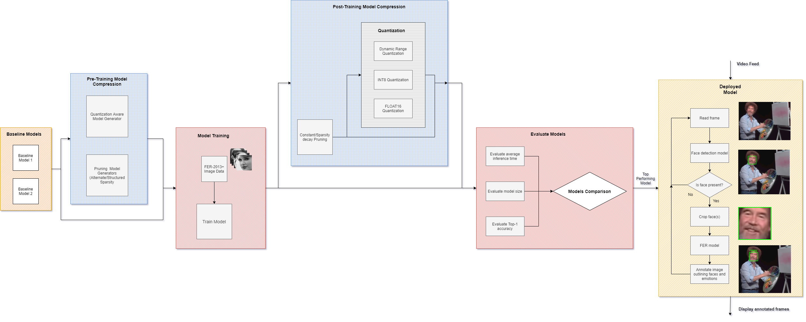

Facial Emotion Recognition at the Edge
---------------------------------------------

Facial emotion recognition implemented in this project is divided into a three phases:

**Phase 1: Face detection**

We investigate the various face detection methods including Viola Jones, HOG/SVM & MTCNN. For deployment on low-cost edge device (Raspberry Pi), lowest latencies were found using Viola Jones method for face detection

**Phase 2: Facial emotion recognition**

We investigate various facial emotion recognition models; compare, contrast and build upon. 

**Phase 3: Edge implementation**

We look at implementing edge computing techniques such as quantization and pruning to enable the model to run on an edge device in realtime at an acceptable FPS rate.

