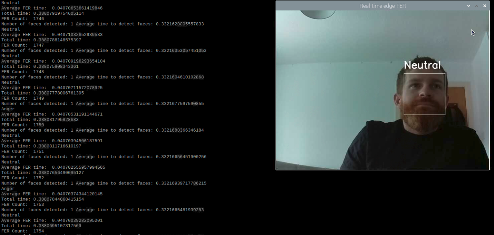

Facial Emotion Recognition at the Edge
---------------------------------------------

High level ML architecture for work carried out in this project visualised below.

**Facial Emotion Recognition**
Facial Emotion Recognition (FER) is the process of automatically deducing a test subjects emotions from facial expressions. Datasets used in training are FER-2013, FER-2013+, CK+ & JAFFE. FER-2013+ was used for building models uploaded to this repo. Importantly, FER-2013+ targets 8 class emotions (as opposed to 7 which some FER datasets use). 
 
 2 baseline CNN based models were built using tensorflow. 

**Model Compression**
The goal of model compression is to reduce the size of a model which can aid in reducing latencys which is advantageous, particularly when deploying models on a resource constrained device. Model compression methods evaluated were quantization and pruning.

**Quantization**
Post training quantization is the process of reducing the precision of weights/activations of a pre-trained model. Methods evaluated are converting weights to 8-bit integers, 16-bit floats and dynamic range quantization. Quantization aware training simluates quantization during training which can help mitigate against the risk of impact to accuracy.

**Pruning**
Pruning is the process of removing or pruning neurons or weights which have little impact on the overall model performance by setting their weight to 0 (or in the case of neuron pruning setting entire column weights to 0). Low magnitude pruning is the process of converting low impact weights or layers to 0, the percent of total pruned weights is defined by the final sparsity parameter. Assigning a final sparsity of 80% would allow for 80% of all weights in selected prunable layers to be set to 0. 

Unstructured pruning is the pruning of groups of connections or full neurons. While unstructured pruning can reduce model size, most frameworks/hardware are unable to benefit from the reduction in connections in terms of computational efficiency. Matrix multiplications take place the same as a baseline model regardless of how many 0s are in the network. Structured pruning on the other hand removes entire neurons and in doing so removes full columns from the matrix multiplication operations improving the overall efficiency of the model.

Utilizing 2 by 4 structured pruning with FLOAT16 Quantization yielded a x6 reduction in model size, x6.3 reduction in latency with a 2.5% trade-off in accuracy

**Face detection**
A number of face detection methods including Viola Jones, HOG/SVM & MTCNN were also evaluated. For deployment on resource constrained edge devices (Raspberry Pi), lowest latencies were found using Viola Jones method for face detection.

Edge-FER implementation runs at 5.4FPS with face detection on edge device.

**Model Deployed on Raspberry Pi**

